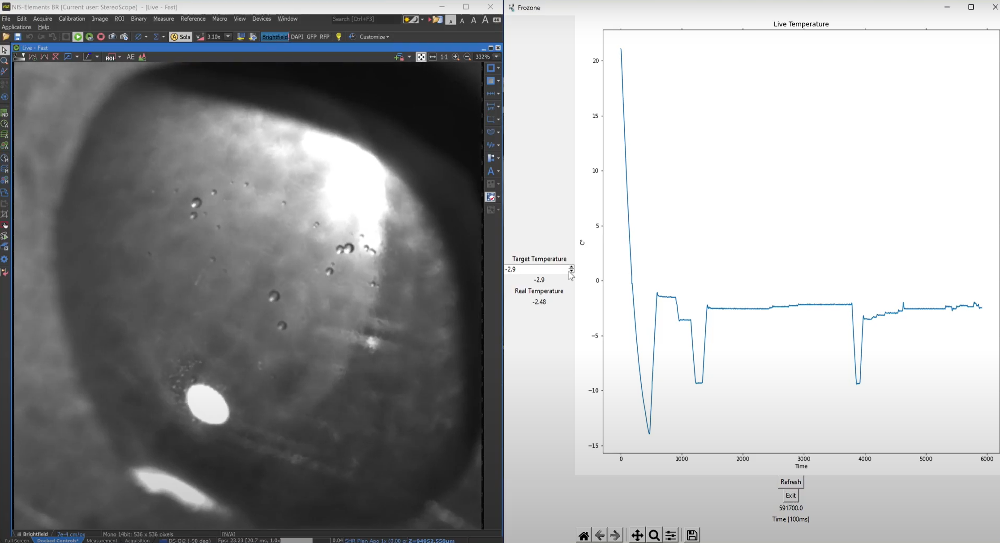

<div id="top"></div>
<!--
*** Thanks for checking out the Best-README-Template. If you have a suggestion
*** that would make this better, please fork the repo and create a pull request
*** or simply open an issue with the tag "enhancement".
*** Don't forget to give the project a star!
*** Thanks again! Now go create something AMAZING! :D
-->


<!-- PROJECT SHIELDS -->
<!--
*** I'm using markdown "reference style" links for readability.
*** Reference links are enclosed in brackets [ ] instead of parentheses ( ).
*** See the bottom of this document for the declaration of the reference variables
*** for contributors-url, forks-url, etc. This is an optional, concise syntax you may use.
*** https://www.markdownguide.org/basic-syntax/#reference-style-links
-->
[![LinkedIn][linkedin-shield]][linkedin-url]


<!-- PROJECT LOGO -->
<br />
<div align="center">
  <a href="https://github.com/igemsoftware2021/UNILausanne-Frozone">
    
  </a>

<h3 align="center">EDNA</h3>

  <p align="center">
    Team iGEM UNILausanne code for controlling the FROZONE device
  </p>
</div>


<!-- TABLE OF CONTENTS -->
<details>
  <summary>Table of Contents</summary>
  <ol>
    <li>
      <a href="#about-the-project">About The Project</a>
    </li>
    <li>
      <a href="#getting-started">Getting Started</a>
      <ul>
        <li><a href="#prerequisites">Prerequisites</a></li>
        <li><a href="#installation">Installation</a></li>
      </ul>
    </li>
    <li><a href="#usage">Usage</a></li>
    <li><a href="#contact">Contact</a></li>
  </ol>
</details>


<!-- ABOUT THE PROJECT -->
## About The Project


Here's the code for controlling the FROZONE device used to measure Antifreeze proteins characteristics. For more information: https://2021.igem.org/Team:UNILausanne/Software
The 3D file for the build is in peltier-assembly.stl more info on https://2021.igem.org/Team:UNILausanne/Experiments
<p align="right">(<a href="#top">back to top</a>)</p>


<!-- GETTING STARTED -->
## Getting Started

EDNA is written in Python so, you must have an environment with all the necessary libraries for it to function.


* python libraries
  ```terminal
  pip install tk
  pip install pyvisa
  pip install simple-pid
  pip install matplotlib
  ```

### Installation

1. Clone the repo
   ```sh
   git clone https://github.com/igemsoftware2021/UNILausanne-Frozone
   ```
<p align="right">(<a href="#top">back to top</a>)</p>


<!-- USAGE EXAMPLES -->
## Usage

For the code to function on your setup you need to replace the id of your instruments directly into the code.

```python
   try:
        U1272a = rm.open_resource('ASRL4::INSTR')       # Insert here the name of thermometer module
        DLM6010 = rm.open_resource('GPIB0::29::INSTR')      #Insert here the name of power supply (find names in the NIMAX software in scan devices)
        DLM6010.write('SOUR:CURR 5.0') 
 ```
  
The GUI is pretty straightforward, a spinbox to change the temperature, and an excel file is written on exit of the program.


  
<p align="right">(<a href="#top">back to top</a>)</p>


<!-- CONTACT -->
## Contact

iGEM UNILausanne 2021 - [Website](https://2021.igem.org/Team:UNILausanne) - igem@unil.ch

Project Link: [https://github.com/igemsoftware2021/UNILausanne-Frozone](https://github.com/igemsoftware2021/UNILausanne-Frozone)

<p align="right">(<a href="#top">back to top</a>)</p>


<!-- MARKDOWN LINKS & IMAGES -->
<!-- https://www.markdownguide.org/basic-syntax/#reference-style-links -->
[contributors-shield]: https://img.shields.io/github/contributors/github_username/repo_name.svg?style=for-the-badge
[contributors-url]: https://github.com/github_username/repo_name/graphs/contributors
[forks-shield]: https://img.shields.io/github/forks/github_username/repo_name.svg?style=for-the-badge
[forks-url]: https://github.com/github_username/repo_name/network/members
[stars-shield]: https://img.shields.io/github/stars/github_username/repo_name.svg?style=for-the-badge
[stars-url]: https://github.com/github_username/repo_name/stargazers
[issues-shield]: https://img.shields.io/github/issues/github_username/repo_name.svg?style=for-the-badge
[issues-url]: https://github.com/github_username/repo_name/issues
[license-shield]: https://img.shields.io/github/license/github_username/repo_name.svg?style=for-the-badge
[license-url]: https://github.com/github_username/repo_name/blob/master/LICENSE.txt
[linkedin-shield]: https://img.shields.io/badge/-LinkedIn-black.svg?style=for-the-badge&logo=linkedin&colorB=555
[linkedin-url]: https://ch.linkedin.com/in/igem-unil-1526621a3
[product-screenshot]: images/screenshot.png
